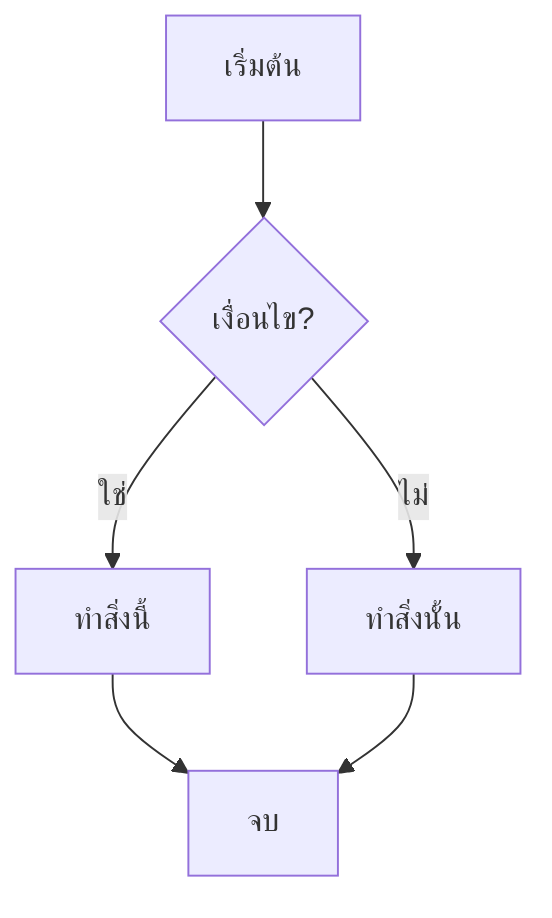

# Flow: [ชื่อ flow]

> สรุป 1 บรรทัด

## Diagram



## Spec

```yaml
flow:
  name: flow-name
  description: อธิบาย flow
  version: 1

trigger:
  type: event | cron | manual | api
  event: event.name          # ถ้า type = event
  cron: "0 8 * * *"          # ถ้า type = cron
  api_endpoint: /api/...     # ถ้า type = api

actors:
  - name: ชื่อผู้กระทำ
    role: soldier | squad_leader | platoon_leader | system | ai

steps:
  - id: step-1
    name: ชื่อ step
    action: create | update | notify | wait | check | api_call
    model: patrol.model.name    # Odoo model ที่เกี่ยว
    description: อธิบายสิ่งที่ทำ
    next: step-2                # step ถัดไป
    on_timeout: step-x          # ถ้าหมดเวลา (optional)
    timeout: 30m                # เวลารอ (optional)

  - id: step-2
    name: ชื่อ step
    action: check
    condition: field == value
    next_true: step-3
    next_false: step-4

models_involved:
  - model: patrol.model.name
    fields_used: [field1, field2]
    operations: [create, read, write]

events_emitted:
  - name: event.name
    when: เมื่อไหร่
    data: [field1, field2]

notifications:
  - when: เมื่อไหร่
    channels: [line, slack, odoo]
    to: commander | squad_leader | all
    severity: critical | high | medium | low
    message_template: "ข้อความ {variable}"
```

## Notes

- เงื่อนไขพิเศษ
- Edge cases
- ข้อจำกัด
