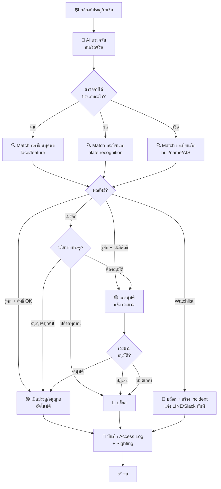

# Flow: Access Control — กล้อง → จดจำ → เปิดประตู/บล็อก

> กล้องที่ประตู/ท่าเรือ ตรวจจับคน/รถ/เรือ → match กับทะเบียน → เปิดอัตโนมัติ หรือ รออนุมัติ หรือ บล็อก

## Diagram



## Spec

```yaml
flow:
  name: access-control
  description: กล้องตรวจจับ → match ทะเบียน → เปิด/บล็อก/รออนุมัติ
  version: 1

trigger:
  type: api
  api_endpoint: /patrol/api/external/ai_incident
  caller: celery-worker (AI detect person/vehicle/vessel at gate camera)

actors:
  - name: กล้อง + AI
    role: system
    action: ตรวจจับ + จดจำ
  - name: เวรยาม
    role: soldier
    action: อนุมัติ/ปฏิเสธ คำขอเข้า-ออก
  - name: ระบบ
    role: system
    action: เปิด/ปิดประตู, บันทึก log

steps:
  - id: detect
    name: AI ตรวจจับ
    action: api_call
    service: celery-worker
    description: ตรวจจับคน/รถ/เรือ จาก frame กล้องที่ประตู
    output: [detection_type, features, plate_number, confidence]
    next: match-registry

  - id: match-registry
    name: Match กับทะเบียน
    action: check
    model: patrol.access.person | patrol.access.vehicle
    description: >
      คน → match face/feature กับ patrol.access.person
      รถ → match plate กับ patrol.access.vehicle
      เรือ → match hull/name กับ patrol.access.vehicle (category=water)
    next: check-result

  - id: check-result
    name: ตรวจผลลัพธ์
    action: check
    conditions:
      - match_status: known, has_access → auto-open
      - match_status: known, no_access → wait-approval
      - match_status: unknown → check gate policy
      - match_status: watchlist → block + incident
    next_known_access: auto-open
    next_known_no_access: wait-approval
    next_unknown: check-gate-policy
    next_watchlist: block-and-alert

  - id: check-gate-policy
    name: ตรวจนโยบายประตู
    action: check
    model: patrol.access.gate
    field: unknown_policy
    conditions:
      - require_approval → wait-approval
      - allow_all → auto-open
      - block_all → block
    next: ตามนโยบาย

  - id: auto-open
    name: เปิดประตูอัตโนมัติ
    action: api_call
    description: ส่งสัญญาณเปิดประตู (HTTP/MQTT)
    model: patrol.access.gate
    fields:
      is_open: true
    next: log-access

  - id: wait-approval
    name: รออนุมัติจากเวรยาม
    action: create
    model: patrol.access.request
    fields:
      state: pending
      gate_id: จากกล้อง
      person_id: ถ้ารู้จัก
      vehicle_id: ถ้ารู้จัก
    description: สร้าง Kanban card → เวรยามกดอนุมัติ/ปฏิเสธ
    next: ตามผลอนุมัติ

  - id: block-and-alert
    name: บล็อก + แจ้งเตือน
    action: create
    model: patrol.incident
    fields:
      incident_type: ai_detection
      severity: critical
      description: "Watchlist match ที่ {gate_name}"
    next: log-access

  - id: log-access
    name: บันทึก Log
    action: create
    model: patrol.access.log
    fields: [gate_id, direction, person_id, vehicle_id, result, timestamp]
    next: create-sighting

  - id: create-sighting
    name: บันทึก Sighting
    action: create
    model: patrol.sighting
    fields: [equipment_id, sighting_type, match_status, lat, lng, timestamp]
    next: end

models_involved:
  - model: patrol.access.person
    operations: [read, search]
  - model: patrol.access.vehicle
    operations: [read, search]
  - model: patrol.access.gate
    operations: [read, write]
  - model: patrol.access.request
    operations: [create, write]
  - model: patrol.access.log
    operations: [create]
  - model: patrol.sighting
    operations: [create]
  - model: patrol.incident
    operations: [create]

gate_types:
  - gate: ประตูทางเข้า
    detects: [person, vehicle]
  - gate: ท่าเรือ
    detects: [person, vessel]
  - gate: ปากร่องน้ำ
    detects: [vessel]

unknown_policies:
  - require_approval: สร้าง request → เวรยามอนุมัติ
  - allow_all: เปิดอัตโนมัติ (บันทึก log)
  - block_all: บล็อก + แจ้งเตือน
```

## Notes

- กล้องแต่ละตัวผูกกับ gate (`gate.camera_id`)
- ถ้ากล้องไม่ได้ผูกกับ gate → เป็นกล้องในพื้นที่ → สร้าง sighting อย่างเดียว ไม่เปิด/ปิดประตู
- เรือที่ปากร่องน้ำ → ไม่มี "ประตู" จริง แต่บันทึก sighting + match watchlist
- Watchlist match → **สร้าง incident ทันที** ไม่ต้องรอ
- รออนุมัติ timeout = ตั้งค่าได้ต่อ gate (default 5 นาที)
