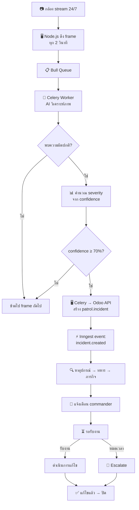

# Flow: กล้อง → AI Detection → Incident → Resolve

> กล้อง (fixed/drone/body cam) ส่งภาพ → AI วิเคราะห์ → พบความผิดปกติ → สร้าง incident อัตโนมัติ

## Diagram



## Spec

```yaml
flow:
  name: ai-detection-incident
  description: AI ตรวจจับจากกล้อง → สร้าง incident → workflow เดียวกับ SOS
  version: 1

trigger:
  type: api
  api_endpoint: /patrol/api/external/ai_incident
  caller: celery-worker

actors:
  - name: กล้อง
    role: system
    action: ส่ง frame
  - name: AI (Celery)
    role: system
    action: วิเคราะห์ภาพ
  - name: ผบ.
    role: squad_leader | platoon_leader
    action: รับงาน + แก้ไข

steps:
  - id: capture-frame
    name: ดึง Frame จาก RTSP
    action: api_call
    service: node-service
    description: >
      FFmpeg ดึง 1 frame จาก rtsp://mediamtx:8554/{stream_path}
      บันทึกเป็น .jpg → ส่งเข้า Bull queue
    next: ai-analyze

  - id: ai-analyze
    name: AI วิเคราะห์
    action: api_call
    service: celery-worker
    task: tasks.analyze_frame
    input: [image_path, camera_id]
    description: >
      YOLO detect: intruder, vehicle, fire, smoke, weapon
      Return: anomalies[] with type, confidence, bbox
    next: check-anomaly

  - id: check-anomaly
    name: ตรวจผลลัพธ์
    action: check
    condition: anomalies.length > 0 AND max_confidence >= 0.70
    next_true: create-incident
    next_false: skip

  - id: create-incident
    name: สร้าง Incident
    action: api_call
    api: POST /patrol/api/external/ai_incident
    input:
      camera_name: equipment.name
      anomaly_type: anomaly.type
      confidence: anomaly.confidence
    description: >
      Odoo API สร้าง patrol.incident:
        severity = critical (≥95%) | high (≥85%) | medium (≥70%)
        ค้นหา equipment → soldier → mission อัตโนมัติ
    next: inngest-workflow

  - id: inngest-workflow
    name: Inngest Incident Workflow
    action: event
    event: incident.created
    description: >
      ใช้ flow เดียวกับ SOS:
      แจ้ง commander → รอรับงาน → escalate → แก้ไข → ปิด

  - id: skip
    name: ข้ามไป frame ถัดไป
    action: complete

models_involved:
  - model: patrol.incident
    fields_used: [name, incident_type, severity, equipment_id, soldier_id, mission_id, lat, lng, ai_type, ai_confidence]
    operations: [create]
  - model: patrol.equipment
    fields_used: [name, stream_path, gps_lat, gps_lng, assigned_soldier_id, mission_ids]
    operations: [read]

events_emitted:
  - name: incident.created
    when: AI พบ anomaly ≥70% confidence
    data: [incident_id, incident_type=ai_detection, severity, equipment_id, ai_type, ai_confidence]

notifications:
  - when: สร้าง incident
    channels: [line, slack, discord, odoo]
    to: commander (ตาม equipment → soldier → unit chain)
    severity: ตาม confidence
    message_template: >
      ⚠️ AI ตรวจพบ: {anomaly_type}
      กล้อง: {camera_name}
      ความมั่นใจ: {confidence}%

severity_mapping:
  confidence_gte_95: critical
  confidence_gte_85: high
  confidence_gte_70: medium
  confidence_lt_70: ignore

anomaly_types:
  - intruder     # บุคคลไม่พึงประสงค์
  - vehicle      # ยานพาหนะต้องสงสัย
  - fire         # ไฟไหม้
  - smoke        # ควัน
  - weapon       # อาวุธ
```

## Notes

- AI model ปัจจุบันเป็น **placeholder** (สุ่ม 5%) → ต้องฝึก YOLO จริง
- Frame rate กล้อง fixed = ทุก 2 วินาที, body cam/drone = ทุก 0.5-1 วินาที
- กล้อง 1 ตัวอาจสร้าง incident ซ้ำ → ควรมี dedup logic (เช่น ไม่สร้างซ้ำภายใน 5 นาที)
- ภาพ anomaly ควรแนบเป็น attachment ใน incident
