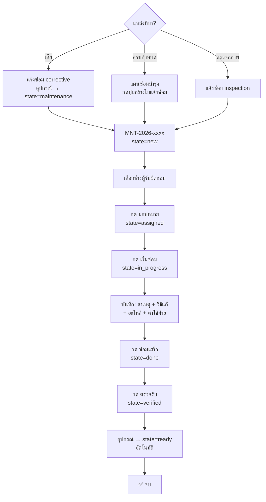

# Flow: Equipment Maintenance

> อุปกรณ์เสีย/ครบกำหนดซ่อม → แจ้งซ่อม → มอบหมายช่าง → ซ่อม → ตรวจรับ → พร้อมใช้

## Diagram



## Spec

```yaml
flow:
  name: equipment-maintenance
  description: ซ่อมบำรุงอุปกรณ์ครบ loop
  version: 1

trigger:
  type: manual | schedule
  manual: กดสร้างใบแจ้งซ่อม
  schedule: กดจากแผนซ่อมบำรุง (patrol.maintenance.schedule)

states:
  - new → assigned → in_progress → done → verified
  - new → cancelled

steps:
  - id: create-request
    name: สร้างใบแจ้งซ่อม
    model: patrol.maintenance.request
    fields: [equipment_id, maintenance_type, description, priority]
    side_effects:
      - ถ้า corrective → equipment.state = maintenance

  - id: assign
    name: มอบหมายช่าง
    validation: ต้องเลือก technician_id
    state: new → assigned

  - id: start
    name: เริ่มซ่อม
    state: assigned → in_progress
    fields_updated: [start_date = now()]

  - id: done
    name: ซ่อมเสร็จ
    state: in_progress → done
    fields_updated: [end_date = now()]
    record: [cause, resolution, part_ids, labor_cost]

  - id: verify
    name: ตรวจรับ
    state: done → verified
    fields_updated: [verified_by, verified_date]
    side_effects:
      - equipment.state = ready

models_involved:
  - model: patrol.maintenance.request
    operations: [create, read, write]
  - model: patrol.maintenance.part
    operations: [create, read]
  - model: patrol.maintenance.schedule
    operations: [read, write]
  - model: patrol.equipment
    operations: [read, write]
```
