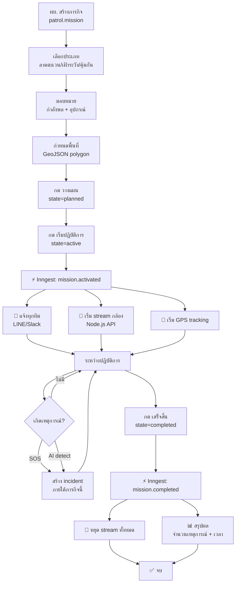

# Flow: Mission Lifecycle

> สร้างภารกิจ → วางแผน → มอบหมายคน+อุปกรณ์ → เริ่มปฏิบัติการ → เสร็จสิ้น

## Diagram



## Spec

```yaml
flow:
  name: mission-lifecycle
  description: ภารกิจตั้งแต่สร้างจนเสร็จ
  version: 1

trigger:
  type: manual
  action: กดปุ่มใน Odoo form

states:
  - draft → planned → active → completed
  - draft → cancelled
  - active → cancelled

steps:
  - id: create
    name: สร้างภารกิจ
    model: patrol.mission
    fields: [name, mission_type, commander_id, unit_id, soldier_ids, equipment_ids, area_geojson, date_start, date_end]

  - id: plan
    name: วางแผน
    action: button action_plan
    state: draft → planned

  - id: activate
    name: เริ่มปฏิบัติการ
    action: button action_activate
    state: planned → active
    validation: ต้องมี soldier_ids ≥ 1
    side_effects:
      - equipment.action_start_stream() สำหรับ equipment ที่ state=ready
      - Inngest event mission.activated
      - แจ้งเตือนทุกทีม

  - id: complete
    name: เสร็จสิ้น
    action: button action_complete
    state: active → completed
    side_effects:
      - equipment.action_stop_stream() ทุกตัว
      - Inngest event mission.completed
      - สรุปผล: นับ incidents

models_involved:
  - model: patrol.mission
    operations: [create, read, write]
  - model: patrol.soldier
    operations: [read]
  - model: patrol.equipment
    operations: [read, write]
  - model: patrol.incident
    operations: [read, count]

events_emitted:
  - name: mission.activated
    data: [mission_id, code, name]
  - name: mission.completed
    data: [mission_id, code, cancelled]
```
