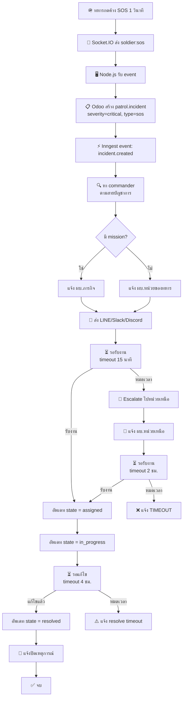

# Flow: SOS → Incident → Escalate → Resolve

> ทหารกด SOS → สร้าง incident อัตโนมัติ → แจ้ง ผบ. → escalate ถ้าไม่ตอบ → แก้ไข → ปิด

## Diagram



## Spec

```yaml
flow:
  name: sos-incident
  description: ทหารกด SOS → สร้าง incident → escalate ตามสายบัญชาการ → resolve
  version: 1

trigger:
  type: event
  event: incident.created
  filter: incident_type == "sos"

actors:
  - name: ทหาร
    role: soldier
    action: กด SOS บนมือถือ
  - name: ผบ.หมู่
    role: squad_leader
    action: รับงาน + แก้ไข
  - name: ผบ.หมวด
    role: platoon_leader
    action: รับงาน (ถ้า escalate)
  - name: ระบบ
    role: system
    action: สร้าง incident, ส่งแจ้งเตือน, escalate อัตโนมัติ

steps:
  - id: sos-press
    name: ทหารกด SOS
    action: api_call
    api: Socket.IO event soldier:sos
    data: { callsign, lat, lng }
    next: create-incident

  - id: create-incident
    name: สร้าง Incident
    action: create
    model: patrol.incident
    fields:
      name: "SOS — {callsign} ({soldier_name})"
      incident_type: sos
      severity: critical
      soldier_id: จาก callsign
      mission_id: จาก soldier.active_mission_id
      lat: จาก event
      lng: จาก event
    next: find-commander

  - id: find-commander
    name: หา Commander
    action: check
    description: >
      ถ้ามี mission → ผบ.ภารกิจ
      ถ้าไม่มี → ผบ.หน่วยของทหาร (unit.commander_id)
    next: notify-commander

  - id: notify-commander
    name: แจ้ง Commander
    action: notify
    channels: [line, slack, discord, odoo]
    severity: critical
    message_template: >
      🚨 SOS จาก {callsign} ({soldier_name})
      ตำแหน่ง: {lat}, {lng}
      ภารกิจ: {mission_code}
    next: wait-accept

  - id: wait-accept
    name: รอรับงาน
    action: wait
    event: incident.accepted
    match: incident_id
    timeout: 15m
    next: mark-in-progress
    on_timeout: escalate

  - id: escalate
    name: Escalate ไปหน่วยเหนือ
    action: api_call
    description: หา parent_unit.commander_id
    model: patrol.unit
    next: notify-escalation

  - id: notify-escalation
    name: แจ้ง Escalation
    action: notify
    channels: [line, slack, discord, odoo]
    severity: critical
    message_template: >
      🔺 ESCALATE: เหตุการณ์ #{incident_id}
      ไม่มีคนรับงานใน 15 นาที
      Escalate ไป: {parent_unit_name}
    next: wait-accept-escalated

  - id: wait-accept-escalated
    name: รอรับงาน (หลัง escalate)
    action: wait
    event: incident.accepted
    match: incident_id
    timeout: 2h
    next: mark-in-progress
    on_timeout: notify-timeout

  - id: notify-timeout
    name: แจ้ง Timeout
    action: notify
    severity: critical
    message_template: "❌ TIMEOUT: เหตุการณ์ #{incident_id} ไม่มีคนรับงาน"
    next: end

  - id: mark-in-progress
    name: อัพเดท In Progress
    action: update
    model: patrol.incident
    fields:
      state: in_progress
    next: wait-resolve

  - id: wait-resolve
    name: รอแก้ไข
    action: wait
    event: incident.resolved
    match: incident_id
    timeout: 4h
    next: mark-resolved
    on_timeout: notify-resolve-timeout

  - id: notify-resolve-timeout
    name: แจ้ง Resolve Timeout
    action: notify
    severity: high
    message_template: "⏰ เหตุการณ์ #{incident_id} ยังไม่แก้ไขใน 4 ชม."
    next: end

  - id: mark-resolved
    name: อัพเดท Resolved
    action: update
    model: patrol.incident
    fields:
      state: resolved
      date_resolved: now()
    next: notify-resolved

  - id: notify-resolved
    name: แจ้งปิดเหตุการณ์
    action: notify
    severity: low
    message_template: "✅ เหตุการณ์ #{incident_id} แก้ไขแล้ว เวลา: {resolution_time}"
    next: end

  - id: end
    name: จบ
    action: complete

models_involved:
  - model: patrol.incident
    fields_used: [name, incident_type, severity, state, soldier_id, mission_id, lat, lng, assigned_to, escalated_to, date_reported, date_resolved, resolution_time]
    operations: [create, read, write]
  - model: patrol.soldier
    fields_used: [callsign, name, unit_id, active_mission_id, last_lat, last_lng]
    operations: [read]
  - model: patrol.unit
    fields_used: [commander_id, parent_id]
    operations: [read]
  - model: patrol.mission
    fields_used: [commander_id, code]
    operations: [read]

events_emitted:
  - name: incident.created
    when: สร้าง incident
    data: [incident_id, incident_type, severity, soldier_id, mission_id, lat, lng]
  - name: incident.accepted
    when: คนรับงาน (กดปุ่ม "เริ่มดำเนินการ" ใน Odoo)
    data: [incident_id]
  - name: incident.resolved
    when: แก้ไขแล้ว (กดปุ่ม "แก้ไขแล้ว" ใน Odoo)
    data: [incident_id, note, resolution_time]

notifications:
  - when: สร้าง incident
    channels: [line, slack, discord, odoo]
    to: commander (ตามสายบัญชาการ)
    severity: critical
    message_template: "🚨 SOS จาก {callsign} ที่ {lat},{lng}"
  - when: escalate
    channels: [line, slack, discord, odoo]
    to: parent_unit.commander
    severity: critical
    message_template: "🔺 ESCALATE: #{incident_id} ไม่มีคนรับ"
  - when: resolved
    channels: [line, slack, odoo]
    to: commander + soldier
    severity: low
    message_template: "✅ #{incident_id} แก้ไขแล้ว"
```

## Notes

- SOS severity = **critical** เสมอ → timeout สั้นกว่า incident อื่น (15 นาที แทน 30)
- Escalation ไปตาม `unit.parent_id.commander_id` อัตโนมัติ
- ถ้าทหารไม่มี unit → fallback ไม่มีคน escalate → timeout
- ทหารกด SOS ซ้ำ → สร้าง incident ใหม่ทุกครั้ง
- GPS ล่าสุดของทหารใช้เป็นตำแหน่ง incident
