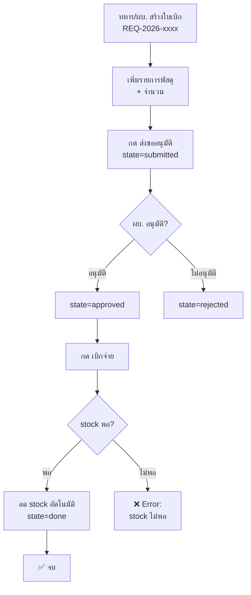

# Flow: Supply Request — เบิกพัสดุ

> ขอเบิก → อนุมัติตามสายบัญชาการ → เบิกจ่าย → stock ลดอัตโนมัติ

## Diagram



## Spec

```yaml
flow:
  name: supply-request
  description: เบิกพัสดุ + อนุมัติ + ลด stock
  version: 1

trigger:
  type: manual
  who: soldier | squad_leader | platoon_leader

states:
  - draft → submitted → approved → done
  - submitted → rejected

steps:
  - id: create
    name: สร้างใบเบิก
    model: patrol.supply.request
    fields: [request_type, soldier_id, unit_id, mission_id, line_ids]

  - id: submit
    name: ส่งขออนุมัติ
    state: draft → submitted

  - id: approve
    name: อนุมัติ
    state: submitted → approved
    who: squad_leader | platoon_leader | company_commander
    fields_updated: [approved_by = current_user]

  - id: issue
    name: เบิกจ่าย
    state: approved → done
    validation: ทุก line.item_id.quantity >= line.quantity
    side_effects:
      - item.quantity -= line.quantity สำหรับทุก line

  - id: reject
    name: ไม่อนุมัติ
    state: submitted → rejected

models_involved:
  - model: patrol.supply.request
    operations: [create, read, write]
  - model: patrol.supply.request.line
    operations: [create, read]
  - model: patrol.supply.item
    operations: [read, write]
```
